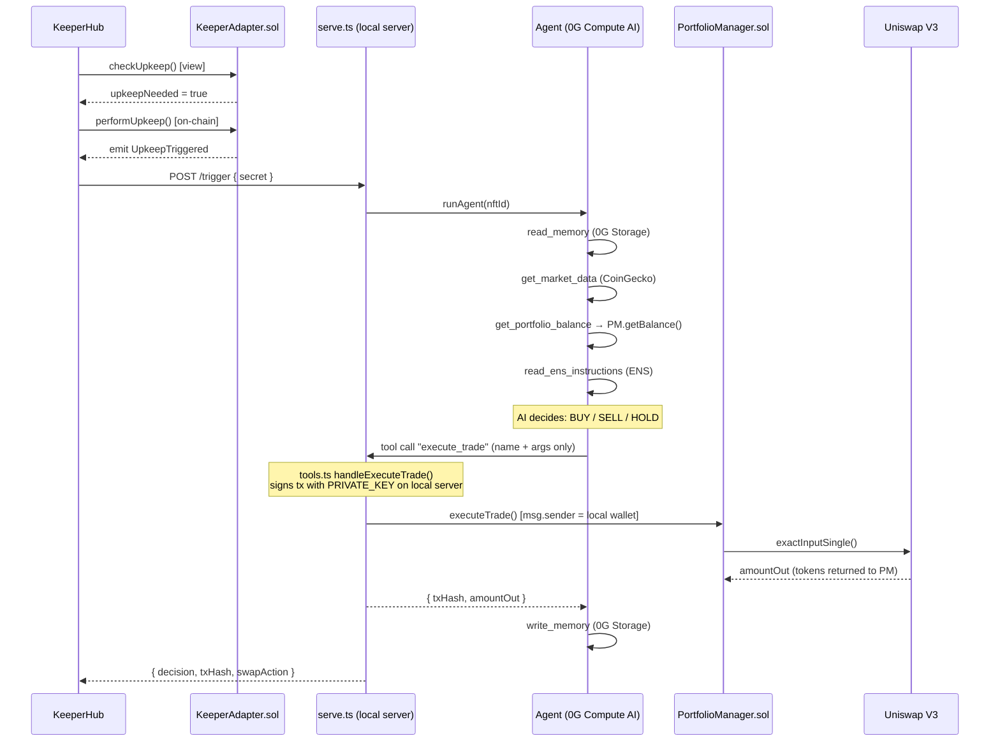
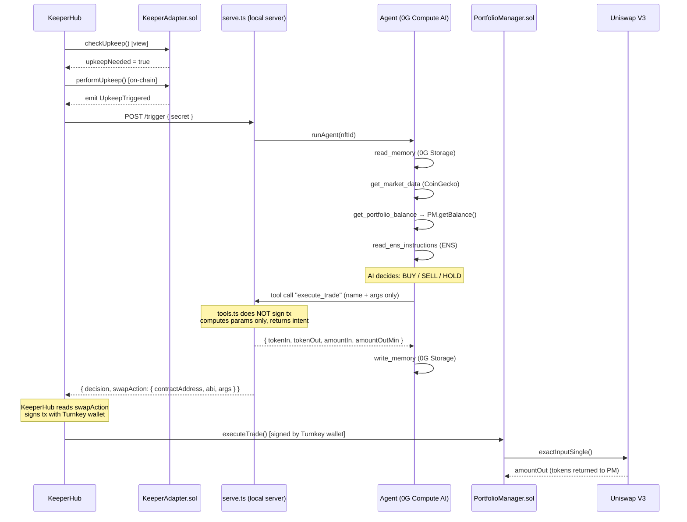
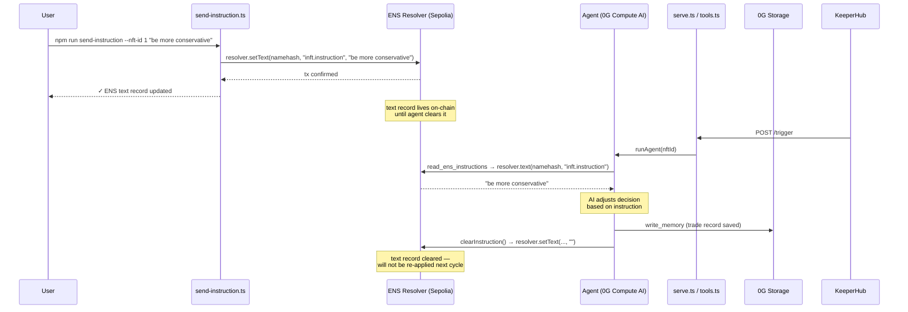
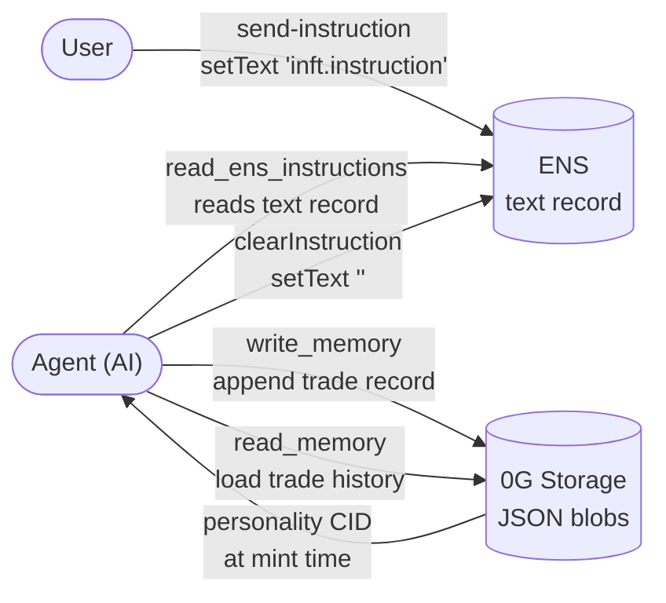

# NerOS — Flow Diagrams

## 1. Current Flow (Local Signing)



---

## 2. Improved Flow (KeeperHub Signing)



---

## 3. Side-by-side Comparison

```
CURRENT FLOW
─────────────────────────────────────────────────────────
KeeperHub ──► /trigger ──► Agent (AI) ──► execute_trade
                                               │
                                    PRIVATE_KEY on local server
                                               │
                                               ▼
                                    PortfolioManager.sol
                                               │
                                               ▼
                                          Uniswap V3


IMPROVED FLOW
─────────────────────────────────────────────────────────
KeeperHub ──► /trigger ──► Agent (AI) ──► returns params only
                                               │
                                    no PRIVATE_KEY needed
                                               │
                                               ▼
                               serve.ts returns swapAction in response
                                               │
                                               ▼
                               KeeperHub Turnkey wallet signs tx
                                               │
                                               ▼
                                    PortfolioManager.sol
                                               │
                                               ▼
                                          Uniswap V3
```

---

## 4. Changes Required for the Improved Flow

```
intelligence/agent/tools.ts
└── handleExecuteTrade()
    Current:  signs tx with PRIVATE_KEY, calls PM.executeTrade() on-chain
    Replace:  compute params only, return { tokenIn, tokenOut, amountIn, amountOutMin }

cli/commands/serve.ts
└── buildSwapAction()              ← already implemented, no changes needed
    reads trace from agent → builds swapAction JSON → returns in HTTP response

contracts/PortfolioManager.sol
└── onlyAuthorized modifier
    Add: KeeperHub Turnkey wallet address to the authorized list

KeeperHub dashboard
└── configure HTTP Action to read swapAction from response
    → web3/write-contract action calls PM.executeTrade()
```

---

## 5. ENS Flow

### 5.1 What each storage layer holds

```
┌─────────────────────────────────────────────────────────────┐
│  ENS (text record)                                          │
│  key: "inft.instruction"                                    │
│  value: "be more conservative"  ← short string, cleared    │
│                                   after agent reads it      │
├─────────────────────────────────────────────────────────────┤
│  0G Storage (JSON blobs)                                    │
│                                                             │
│  Personality CID → { name, ensName, riskTolerance, ... }   │
│  Memory CID     → { trades: [...], totalPnL: 187.40 }      │
│                   append-only, never overwritten            │
└─────────────────────────────────────────────────────────────┘
```

### 5.2 Human instruction flow (send-instruction → agent)



### 5.3 ENS vs 0G Storage — who writes, who reads



### 5.4 ENS name in personality — what it is and is not

```
npm run mint
    │
    ├─ User types: "nerosbot"
    │       └─► ensName = "nerosbot.eth"  ← JavaScript string only
    │
    ├─ personality JSON uploaded to 0G:
    │       { name: "NerOSBot", ensName: "nerosbot.eth", ... }
    │                                ↑
    │                   stored as a plain field in JSON
    │                   NOT registered in ENS registry
    │
    └─ iNFT.mint(personalityCID, riskLevel) on Sepolia
            └─► only CID stored on-chain, ensName never touches ENS registry

Why it still works:
    ENS_RESOLVER env var → points directly at a Sepolia resolver contract
    resolver.setText(namehash("nerosbot.eth"), ...)
        └─► works without registering the name
        └─► because you call the resolver contract directly,
            bypassing the ENS registry ownership check
```
