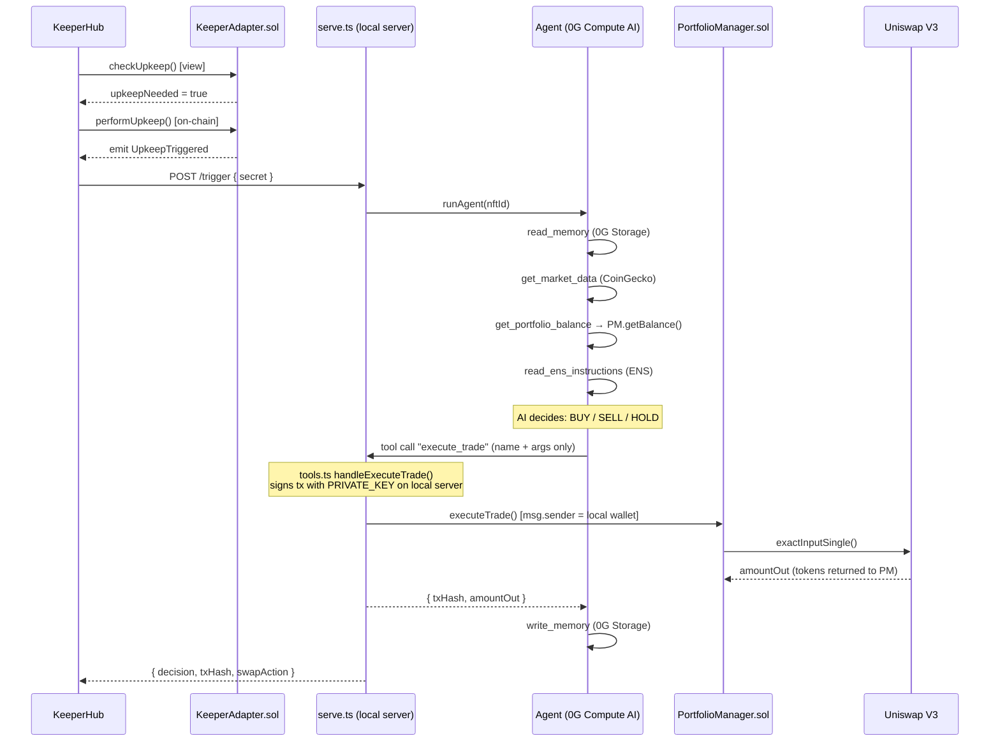
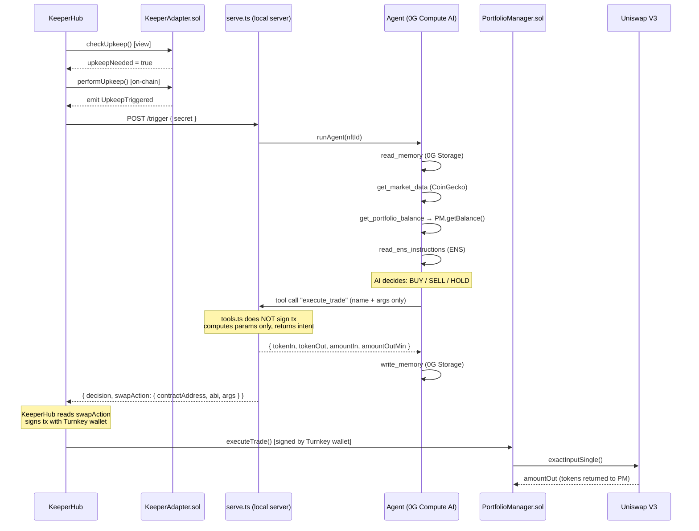

# NerOS — Flow Diagrams

## 1. Current Flow (Local Signing)



---

## 2. Improved Flow (KeeperHub Signing)



---

## 3. Side-by-side Comparison

```
CURRENT FLOW
─────────────────────────────────────────────────────────
KeeperHub ──► /trigger ──► Agent (AI) ──► execute_trade
                                               │
                                    PRIVATE_KEY on local server
                                               │
                                               ▼
                                    PortfolioManager.sol
                                               │
                                               ▼
                                          Uniswap V3


IMPROVED FLOW
─────────────────────────────────────────────────────────
KeeperHub ──► /trigger ──► Agent (AI) ──► returns params only
                                               │
                                    no PRIVATE_KEY needed
                                               │
                                               ▼
                               serve.ts returns swapAction in response
                                               │
                                               ▼
                               KeeperHub Turnkey wallet signs tx
                                               │
                                               ▼
                                    PortfolioManager.sol
                                               │
                                               ▼
                                          Uniswap V3
```

---

## 4. Changes Required for the Improved Flow

```
intelligence/agent/tools.ts
└── handleExecuteTrade()
    Current:  signs tx with PRIVATE_KEY, calls PM.executeTrade() on-chain
    Replace:  compute params only, return { tokenIn, tokenOut, amountIn, amountOutMin }

cli/commands/serve.ts
└── buildSwapAction()              ← already implemented, no changes needed
    reads trace from agent → builds swapAction JSON → returns in HTTP response

contracts/PortfolioManager.sol
└── onlyAuthorized modifier
    Add: KeeperHub Turnkey wallet address to the authorized list

KeeperHub dashboard
└── configure HTTP Action to read swapAction from response
    → web3/write-contract action calls PM.executeTrade()
```
